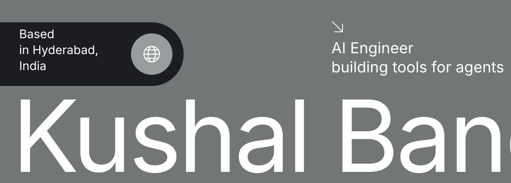
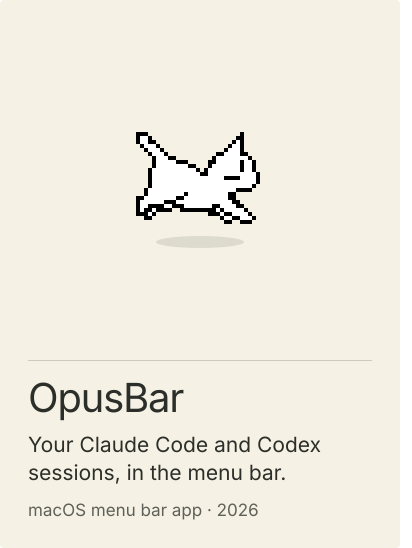
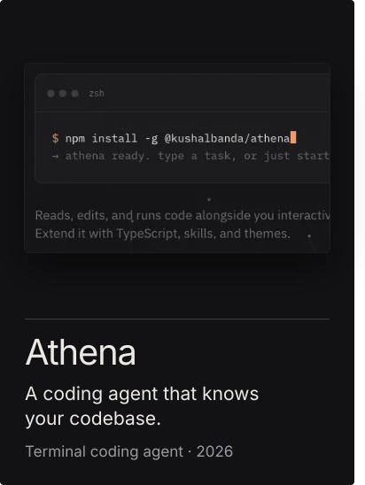
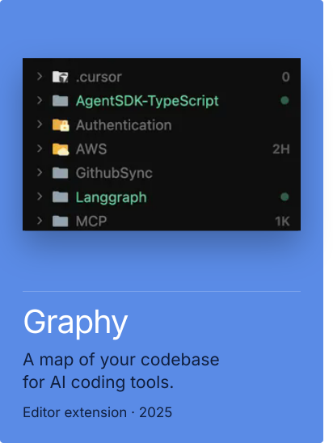

<a href="https://kushalbanda.com"><picture><source media="(max-width: 600px)" srcset="assets/header-sm.svg"></picture></a>

<a href="https://kushalbanda.com/opusbar/"><picture><source media="(max-width: 600px)" srcset="assets/opusbar-sm.svg"></picture></a><a href="https://kushalbanda.com/athena/"><picture><source media="(max-width: 600px)" srcset="assets/athena-sm.svg"></picture></a><a href="https://open-vsx.org/extension/kushalBanda/graphy"><picture><source media="(max-width: 600px)" srcset="assets/graphy-sm.svg"></picture></a><a href="https://kushalbanda.com/openticker/"><picture><source media="(max-width: 600px)" srcset="assets/openticker-sm.svg"></picture></a>

### I design and build products for people who work with AI agents.

Four products, one line: watch your agents, code with one, guide them, put them to work. [OpusBar](https://github.com/kushalBanda/OpusBar) shows what your Claude Code and Codex sessions are doing, right in the macOS menu bar. [Athena](https://github.com/kushalBanda/Athena) is an open-source coding agent for the terminal that knows your codebase, not just your prompt. [Graphy](https://github.com/kushalBanda/Graphy) gives AI coding tools a map of your codebase before they touch it. [OpenTicker](https://github.com/kushalBanda/openticker), a self-hosted trading platform your AI agent operates and you control, is next.

By day I'm an AI engineer working on production agent systems. More at **[kushalbanda.com](https://kushalbanda.com)**.

Python · TypeScript · FastAPI · LangGraph · RAG · PostgreSQL · ClickHouse · Kafka · Redis · AWS · Docker

### I write about AI most weeks

<!-- medium:start -->
- [Using Claude Code: Spending your effort](https://pub.towardsai.net/using-claude-code-spending-your-effort-cadb1577339f) Towards AI · 4 Oct 2026
- [GPT-6 Sol vs Claude Opus 5.5: Same Week, Different Bet](https://generativeai.pub/gpt-6-sol-vs-claude-opus-5-5-same-week-different-bet-e975a66dcb6b) Generative AI · 26 Sep 2026
- [Claude Opus 5.5: Cheaper, Faster, and It Won’t Stop Thinking](https://pub.towardsai.net/claude-opus-5-5-cheaper-faster-and-it-wont-stop-thinking-da8989cc6979) Towards AI · 24 Sep 2026
- [Most of Your LLM Calls Are a Waste. Here’s How Jev Fixes It.](https://medium.com/write-a-catalyst/most-of-your-llm-calls-are-a-waste-heres-how-jev-fixes-it-964b0a3d6b19) Write A Catalyst · 23 Sep 2026
- [200x Faster, 400x Cheaper, Zero Words: Inside Jev](https://medium.com/design-bootcamp/200x-faster-400x-cheaper-zero-words-inside-jev-c1a43478033e) Bootcamp · 20 Sep 2026
<!-- medium:end -->

[All posts on Medium](https://medium.com/@kushalbanda)

 

<a href="mailto:kushalbanda265@gmail.com"><picture><source media="(max-width: 600px) and (prefers-color-scheme: dark)" srcset="assets/footer-sm-dark.svg"><source media="(max-width: 600px)" srcset="assets/footer-sm.svg"><source media="(prefers-color-scheme: dark)" srcset="assets/footer-dark.svg"></picture></a>

<a href="mailto:kushalbanda265@gmail.com">Email</a> ·
<a href="https://kushalbanda.com">kushalbanda.com</a> ·
<a href="https://www.linkedin.com/in/kushalbanda/">LinkedIn</a> ·
<a href="https://medium.com/@kushalbanda">Medium</a> ·
<a href="https://leetcode.com/u/rQ0FAJb1Jj/">LeetCode</a>

